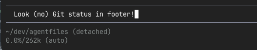
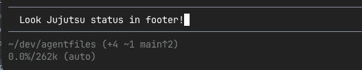

# Pi Jujutsu footer extension (`jj-footer.ts`)

Canonical maintainer documentation for the Pi extension at:

- `agents/pi/.pi/agent/extensions/jj-footer.ts`

## Purpose

When Pi runs in a Jujutsu repository, this extension *replaces* Pi's detached-HEAD footer label with a `jj`-aware label showing:

- nearest bookmark name
- commits ahead of that bookmark (`↑N`)
- working-copy file counts (`+`, `~`, `-`, `!`)

### Before:

### After: Pi shows the active bookmark, commits ahead, and working-copy changes:

## Where it is loaded from

- Extension file: `agents/pi/.pi/agent/extensions/jj-footer.ts`
- This document: `docs/pi/jj-footer-extension.md`

We keep implementation details here (repo docs) while keeping a source-level pointer in the extension file.

## Behaviour summary

The overall design philosophy of the extension is to make a targeted update to the existing footer rather than replacing it completely and duplicating information unnecessarily.

1. On `session_start`, the extension searches upward from `cwd` for a `.jj/` directory.
2. If no JJ repo is found, it leaves the default footer behaviour.
3. If a JJ repo is found, it installs a *wrapped* footer data provider.
4. The wrapper only overrides `getGitBranch()` when Pi would show `detached`.
5. The rendered label combines status counts and bookmark/ahead info.

Example label:

- `+2 ~1 main↑3`
- `trunk` (when there are no local file changes)

## Data collection

The extension reads JJ state with commands that all pass `--ignore-working-copy` to avoid snapshotting/re-writing the working-copy commit (`@`) as a side effect of footer refresh.

Commands used:

- bookmark/ahead anchor: `jj log -r 'latest(heads(::@ & bookmarks()))' --ignore-working-copy ...`
- ahead count: `jj log -r '<anchor-commit>..@' --ignore-working-copy ...`
- file counts: `jj status --ignore-working-copy --quiet ...`

`jj` status classification:

- `A`, `?` → added (`+`)
- `M`, `R`, `T` → changed (`~`)
- `D` → deleted (`-`)
- `C` → conflicted (`!`)

Only lines matching `<CODE> <PATH>` are counted.

### Note on file-count freshness

Because `jj status` runs with `--ignore-working-copy`, footer file counts reflect the last snapshotted working-copy state rather than forcing a new snapshot during refresh.

## Refresh strategy

The extension uses both mechanisms intentionally:

- `turn_end` event: refreshes footer state after agent actions
- `fs.watch(.jj/, recursive)` with debounce: catches JJ metadata changes (commits/bookmarks)

A queued refresh loop prevents overlapping refresh work and ensures the newest state is eventually shown.

## Failure behaviour

If refresh fails (timeouts/command issues), state falls back to:

- bookmark: `(unavailable)`
- ahead: `0`
- all file counts: `0`

The extension logs debug details via `pi.logger?.debug?.(...)`.

## Maintenance notes

When changing `jj-footer.ts`, keep this document updated if you change:

- displayed label format
- status classification
- JJ commands or revsets
- refresh/watch strategy
- error/fallback behaviour
